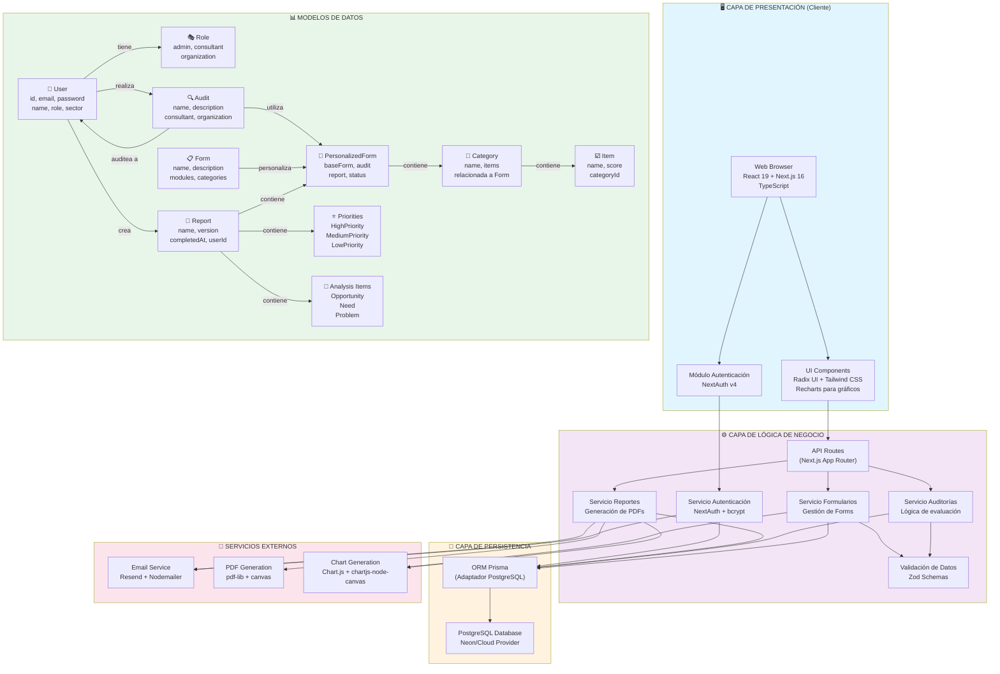

# Diagrama Lógico (UML) - DiagnoSys

## Arquitectura de Componentes del Sistema



## Descripción de Componentes

### 🖥️ Capa de Presentación
- **Web Browser**: Interfaz React moderna y responsiva
- **UI Components**: Sistema de componentes Radix UI + Tailwind
- **Auth UI**: Módulo de autenticación con NextAuth

### ⚙️ Capa de Lógica de Negocio
- **API Routes**: Endpoints REST con Next.js
- **Servicio Autenticación**: Gestión de usuarios, sesiones, JWT
- **Servicio Formularios**: CRUD de formularios dinámicos
- **Servicio Auditorías**: Lógica de evaluaciones
- **Servicio Reportes**: Generación de reportes en PDF
- **Validación**: Esquemas Zod para validar datos

### 💾 Capa de Persistencia
- **ORM Prisma**: Mapeo objeto-relacional
- **PostgreSQL**: Base de datos relacional

### 🔗 Servicios Externos
- **Email**: Resend/Nodemailer para notificaciones
- **PDF**: pdf-lib y canvas para generación
- **Charts**: Chart.js para gráficos

### 📊 Modelos de Datos Principales
- **User + Role**: Gestión de usuarios y permisos
- **Audit**: Auditorías entre consultores y organizaciones
- **Form + Category + Item**: Sistema de formularios dinámicos
- **PersonalizedForm**: Instancias personalizadas de formularios
- **Report**: Reportes finales con análisis
- **Priorities & Analysis**: Clasificación de oportunidades, necesidades y problemas

## Flujos Principales

### 1️⃣ Flujo de Autenticación
```
Usuario → Login UI → NextAuth → Validación Password → JWT → Sesión Activa
```

### 2️⃣ Flujo de Auditoría
```
Consultor → Crear Auditoría → Seleccionar Formulario → Personalizar → Compartir → Organización responde → Genera Reporte
```

### 3️⃣ Flujo de Generación de Reporte
```
Auditoría Completada → Procesar Datos → Generar Gráficos → Crear PDF → Enviar Email → Almacenar Reporte
```
